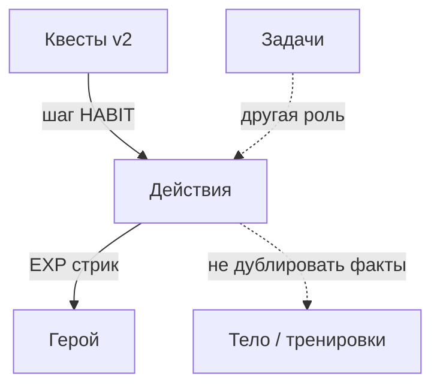
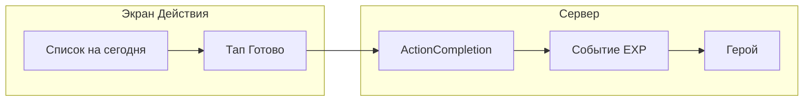

# ТЗ: модуль «Действия» (Real Hero)

**Версия документа:** 1.0  
**Дата:** 2026-03-29  
**Статус:** проектное ТЗ (реализация по этапам; MVP — шаблоны и отметки «на сегодня»)

**Связанные документы:** `ПАСПОРТ_ПРОЕКТА.md` (п. 5.4–5.5), `ТЗ_КВЕСТЫ_И_ТУДУ.md` (тип шага `HABIT`).

---

## 1. Назначение и границы

### 1.1. Зачем

**«Действия»** — экран, на котором пользователь **каждый день** видит список повторяемых и контекстных **действий из реальной жизни** и **одним жестом отмечает выполнение**, получая обратную связь в духе RPG: опыт, серия (streak), связь с экраном **«Герой»**.

Модуль совмещает роли:

- **Трекер привычек** — шаблоны с расписанием (ежедневно, дни недели, N раз в неделю).
- **Чеклист дня** — то, что должно быть сделано **сегодня** по этим шаблонам и (в v2) по квестам и автопроверкам из других модулей.

**Отличие от «Задачи»:** задачи — **сроки, проекты, входящие**; действия — **повторяемость, идентичность «я такой человек»** и RPG-фидбек. Пересечение с квестами — через явные связи (см. `ТЗ_КВЕСТЫ_И_ТУДУ.md`).

### 1.2. Ориентиры у конкурентов (без копирования UI)

| Продукт | Что взять как идею | Чего избегать в RH |
|--------|---------------------|---------------------|
| **Habitica** | Разделение сущностей: привычки / ежедневные ритуалы / разовые цели; стрики; награды | Перегруз интерфейса; обязательные «штрафы HP»; мультиплеер |
| **LifeRPG и аналоги** | XP, уровень, «миссии», связь действия с прогрессом персонажа | Слияние со списком долгих задач без границ экранов |
| **Минималистичные трекеры (Loop, Streaks)** | Быстрый список дня, визуал серии | Слабая связь с «Герой» — компенсируется в RH единым хабом |

### 1.3. Входит в объём

| Область | Содержание |
|--------|------------|
| Модель данных | Шаблон действия, факт выполнения за календарный день, источник отметки |
| Поведение | Расчёт «на сегодня», выполнение / откат за день, стрик по шаблону |
| Геймификация | EXP и события для «Героя» и будущих достижений (производные от фактов, см. паспорт п. 5.5) |
| UI | Экран «Действия»: список дня, создание/редактирование шаблонов, пустые состояния |

### 1.4. Не входит в MVP (v1 экрана «Действия»)

- Социальные партии, совместные квесты, обмен шаблонами.
- Полная интеграция шагов квеста типа `HABIT` — **v2**, после движка квестов.
- Автозачёт по событиям из «Тело» / «Финансы» — **v2** (см. п. 6).
- «Плохие» привычки с отрицательным XP — только как опция продукта, не обязательная в v1.

---

## 2. Ключевые понятия

| Термин | Описание |
|--------|----------|
| **ActionTemplate (шаблон)** | Пользовательское действие: название, опционально иконка/эмодзи, расписание, активность. |
| **Расписание** | Правило, по которому на календарный день появляется «слот»: ежедневно; по дням недели; N раз в неделю (упрощённо — счётчик за скользящую неделю или фиксированные дни — решение при реализации). |
| **ActionCompletion (отметка)** | Факт «выполнено» за **локальный** день `YYYY-MM-DD` для шаблона; время `completedAt`; `source`: `MANUAL` \| `AUTO` \| `QUEST` (последние — v2). |
| **Стрик** | Число подряд идущих календарных периодов (день или «неделя по правилу»), в которых выполнено условие шаблона — **точная формула задаётся при реализации**, документируется в коде/API. |

**Правило источника правды (паспорт):** там, где данные уже есть в **Тело** / **Финансы** (например `WorkoutLog`), не дублировать ввод: в v2 — автозачёт или deep link на экран ввода; в v1 допускается только ручная отметка, если автоматизации ещё нет.

---

## 3. Пользовательские сценарии (MVP)

1. Пользователь создаёт **шаблон** («Утренняя зарядка», ежедневно).
2. На экране **«Сегодня»** видит строки, сгенерированные по шаблонам на текущую дату.
3. Нажимает **«Готово»** — создаётся отметка, начисляется EXP (или пишется событие геймификации), обновляется отображение стрика.
4. Ошибочно отметил — **откат за сегодня** (одна операция на шаблон за день).
5. Нет шаблонов — **пустое состояние** с CTA «Добавить действие».

---

## 4. Функциональные требования

### 4.1. MVP (v1)

| ID | Требование |
|----|------------|
| D1 | CRUD шаблонов действий (минимум: создать, переименовать, выключить, удалить). |
| D2 | Вычисление списка **на сегодня** по активным шаблонам и расписанию. |
| D3 | Отметка выполнения за сегодня и откат отметки. |
| D4 | Отображение **стрика** по шаблону (или агрегировано по дню — уточнение UI). |
| D5 | Начисление **EXP** / запись **события геймификации** в общий слой (совместимо с заделом «Герой»). |
| D6 | Пустое состояние и краткая подсказка: чем «Действия» отличаются от «Задачи». |

### 4.2. v2

| ID | Требование |
|----|------------|
| V1 | Появление в списке дня шагов квеста типа `HABIT` (см. `ТЗ_КВЕСТЫ_И_ТУДУ.md`) с бейджем квеста. |
| V2 | Автозачёт отметки при появлении связанного события (например, `WorkoutLog` за день) — без второго ручного ввода того же факта. |
| V3 | Опционально: «положительные / отрицательные» привычки; heatmap / календарь. |

---

## 5. Модель данных (эскиз Prisma)

Имена и поля — ориентир; при реализации согласовать с существующим стилем `schema.prisma`.

```text
ActionTemplate
  id, userId, title, icon (String?, эмодзи или ключ иконки)
  scheduleJson String   // JSON: тип расписания + параметры
  active       Boolean @default(true)
  sortOrder    Int @default(0)
  createdAt, updatedAt

ActionCompletion
  id, userId, templateId
  localDate    String   // YYYY-MM-DD, локальный календарный день пользователя
  completedAt  DateTime
  source       enum MANUAL | AUTO | QUEST
  createdAt

@@unique([userId, templateId, localDate])  // одна отметка на шаблон на день
```

Индексы: `(userId, localDate)`, `(userId, templateId)`.

---

## 6. Интеграция с другими модулями



- **Герой:** только производные метрики и события; не хранить дублирующие «сырые» действия вне `ActionCompletion` / квестов.
- **Квесты:** при реализации `HABIT` в payload шага указать ссылку на `actionTemplateId` или правило автопроверки — одна правда на стороне прогресса квеста (как для задач в `ТЗ_КВЕСТЫ_И_ТУДУ.md`).

---

## 7. API (эскиз префикса)

Предполагаемый префикс: `/api/v1/actions/*` (после авторизации).

| Метод | Путь | Назначение |
|-------|------|------------|
| GET | `/actions/templates` | Список шаблонов пользователя |
| POST | `/actions/templates` | Создать шаблон |
| PATCH | `/actions/templates/:id` | Обновить / выключить |
| DELETE | `/actions/templates/:id` | Удалить (и политика по отметкам — каскад или запрет) |
| GET | `/actions/today` | Агрегат на сегодня: шаблон + выполнено ли + стрик |
| POST | `/actions/complete` | `{ templateId, localDate? }` — по умолчанию сегодня |
| POST | `/actions/uncomplete` | Откат за указанный день |

Формат дат — согласован с `UserTask` / замерами тела: локальная строка даты там, где это день без часового пояса в UI.

---

## 8. UI: wireframe экрана «Действия»

```text
┌─────────────────────────────────────────┐
│  Действия                    [+] новое   │
├─────────────────────────────────────────┤
│  Сегодня · вс 29 мар   🔥 серия 12     │
│  ████████░░  Герой: ур. 7  +45 XP сег. │
├─────────────────────────────────────────┤
│  □ Утренняя зарядка          ⚔ ритуал  │
│     ежедневно · стрик 5        [Готово] │
├─────────────────────────────────────────┤
│  □ 10k шагов (цель дня)      📍 тело    │
│     v2: автозачёт*            [Открыть] │
├─────────────────────────────────────────┤
│  ☑ Вода 2 л                  💧        │
│     выполнено 08:40                    │
├─────────────────────────────────────────┤
│  📜 Из квеста «Сила I»        (v2)      │
│  □ Белок ≥ цели             [Готово]   │
├─────────────────────────────────────────┤
│  [ Все шаблоны · Календарь · Настройки ]│
└─────────────────────────────────────────┘
* в MVP блок с автозачётом может отсутствовать или быть ручным
```

Поток отметки:



---

## 9. Нефункциональные требования

- Те же принципы безопасности, что у остальных `/api/v1/*`: данные изолированы по `userId`.
- БД: SQLite в dev; совместимость с будущим PostgreSQL через Prisma.
- Офлайн / очередь отметок — по общей политике приложения (если появится для задач — выровнять поведение).

---

## 10. Критерии приёмки MVP

- Пользователь создаёт не менее одного шаблона и видит его в списке «Сегодня» в соответствии с расписанием.
- Отметка и откат за сегодня работают без расхождений с отображением.
- В логах/событиях геймификации фиксируется начисление (или заглушка с известным контрактом для «Герой»).
- В паспорте и навигации модуль назван согласованно: **«Действия»**.

---

*Конец документа.*
