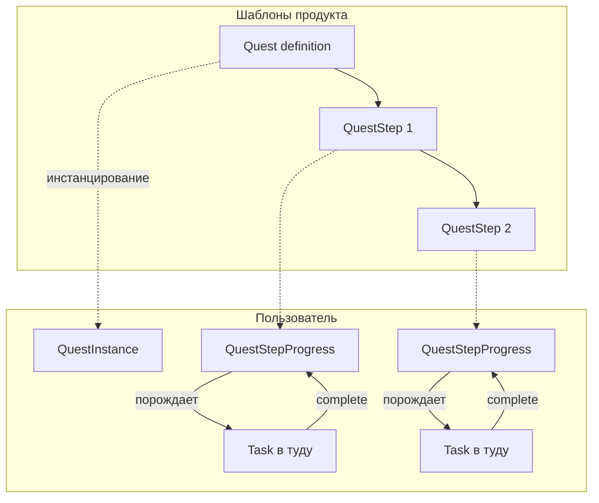
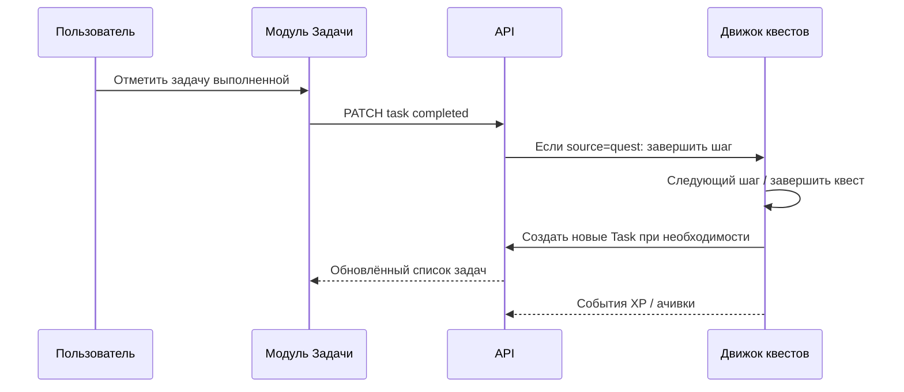

# ТЗ: Квесты и интеграция с модулем «Задачи» (Real Hero)

**Версия документа:** 1.0  
**Дата:** 2026-03-29  
**Статус:** проектное ТЗ (реализация по этапам, после базового модуля задач)

---

## 1. Назначение и границы

### 1.1. Зачем

**Квест** — это сюжетная или целевая цепочка из одного или нескольких **шагов** с правилами прогресса и наградами (XP, достижения, косметика аватара). Пользователь видит квест на экране **«Герой»** (и/или отдельном разделе), а **исполняемые единицы дня** попадают в **«Задачи»** как обычные задачи со связью «порождена квестом», чтобы не вести двойной учёт.

### 1.2. Входит в объём

| Область | Содержание |
|--------|------------|
| Модель данных | Квест, шаг квеста, экземпляр шага у пользователя, связь с задачей в туду |
| Поведение | Активация квеста, генерация/обновление задач в туду, завершение шага и квеста |
| Геймификация | Начисления по правилам квеста, события для достижений и аватара (через общий слой событий) |
| UI (логика) | Откуда открыть квест, как в туду отличить «квестовую» задачу |

### 1.3. Не входит в первую итерацию (v1 квестов)

- Мультиплеер, обмен квестами между пользователями.
- Полноценный редактор квестов пользователем (конструктор сценариев) — допускается только **пресеты от продукта**.
- Сложная ветвящаяся логика (ес/то) — в v1 достаточно **линейной** цепочки шагов и простых условий.

---

## 2. Ключевые понятия

| Термин | Описание |
|--------|----------|
| **Quest (определение)** | Шаблон квеста: название, описание, список шагов, награды, условия доступности (уровень героя, сезон и т.д.). |
| **QuestInstance** | Принятый пользователем квест: статус `active` / `completed` / `abandoned` / `expired`, даты. |
| **QuestStep** | Шаг в шаблоне: что сделать, в каком порядке, тип шага (см. п. 3). |
| **QuestStepProgress** | Состояние шага у пользователя в рамках `QuestInstance`: `pending` / `done` / `skipped` (если разрешено). |
| **Task (туду)** | Пользовательская задача. Если создана из квеста — хранит **`questInstanceId` + `questStepId`** (или аналог) и признак **`source: quest`**. |
| **Подтягивание в туду** | Автоматическое создание или обновление задач при активации квеста и при переходе к следующему шагу. |

**Правило единственности источника:** факт «шаг выполнен» фиксируется на стороне **прогресса квеста**; задача в туду либо **закрывается пользователем** и тогда сервер помечает шаг выполненным, либо шаг закрывается **из UI квеста** — и связанная задача синхронно приводится к состоянию «выполнено» (см. п. 6).

---

## 3. Типы шагов (минимальный набор для v1)

| Тип | Смысл | Отражение в туду |
|-----|--------|------------------|
| `TASK` | Одноразовое действие | Одна задача с заголовком и дедлайном по правилу квеста |
| `REPEAT` | Повтор N раз за период | Одна задача с счётчиком или N отдельных подзадач (решение продукта — см. п. 7) |
| `HABIT` | Связь с существующей привычкой/событием (позже); см. **`ТЗ_ДЕЙСТВИЯ.md`** | Задача-дня или автопроверка по событию из другого модуля |

**В v1** достаточно **`TASK`** и упрощённого **`REPEAT`** (например: «3 раза за неделю» — одна задача с прогрессом 0/3).

---

## 4. Пользовательские сценарии

1. **Принять квест** с экрана «Герой» → создаётся `QuestInstance`, в туду появляются задачи **текущего** шага (или всех открытых — по политике UX).
2. **Отметить задачу выполненной** в «Задачи» → сервер обновляет квестовый шаг → при необходимости создаёт задачи следующего шага → начисляет награды.
3. **Открыть квест с экрана задачи** по бейджу «Квест» → переход к карточке квеста (deep link на «Герой» или модалка).
4. **Отказаться от квеста** → `abandoned`, связанные задачи: архивировать или пометить отменёнными (единая политика).

---

## 5. Архитектура связей (логическая)



---

## 6. Синхронизация: квест ↔ туду



**Конфликты:** если пользователь удаляет задачу квеста — варианты: (а) восстановить при следующем sync; (б) считать «пропуск» с предупреждением; в ТЗ зафиксировать выбранный вариант до реализации.

---

## 7. Решения продукта (зафиксировать до кодирования)

| # | Вопрос | Варианты |
|---|--------|----------|
| R1 | Показывать в туду только **текущий шаг** или **все шаги** сразу? | Только активные / все с замком на будущее |
| R2 | Один шаг = **одна** задача или допускаются **подзадачи**? | Влияет на схему БД |
| R3 | Повторяемый шаг: **одна задача с прогрессом** или **несколько копий**? | UX и анти-дубли |
| R4 | Удаление/отмена задачи квеста | Восстановление / пропуск / блокировка удаления |

---

## 8. Данные (черновик полей, без привязки к миграции)

**Quest** (шаблон): `id`, `slug`, `title`, `description`, `stepOrder[]`, `rewardXp`, `achievementId?`, `availableFrom?`, `availableTo?`, `minHeroLevel?`.

**QuestInstance**: `id`, `userId`, `questId`, `status`, `startedAt`, `completedAt?`.

**QuestStep** (шаблон шага): `id`, `questId`, `order`, `type`, `title`, `payloadJson` (дедлайны, N повторов, текст).

**QuestStepProgress**: `id`, `instanceId`, `stepId`, `status`, `progressCurrent`, `progressTarget`.

**Task** (расширение будущей модели задач): `source: manual | quest`, `questInstanceId?`, `questStepId?`, `questStepProgressId?`.

**Событие геймификации** (отдельная таблица или очередь): `type`, `userId`, `payload`, `createdAt` — для корреляции с аватаром и достижениями.

---

## 9. API (эскиз префикса)

Предполагаемый префикс: `/api/v1/quests/*` (после появления авторизации и задач).

- `GET /quests/definitions` — доступные шаблоны квестов.
- `POST /quests/instances` — `{ questId }` — принять квест.
- `GET /quests/instances` — активные и завершённые.
- `GET /quests/instances/:id` — детали + прогресс.
- `POST /quests/instances/:id/abandon` — отказ.

Завершение шага **предпочтительно** через общий endpoint задач: `PATCH /tasks/:id` с `completed: true`, внутри — вызов движка квестов.

---

## 10. UI: ориентиры экранов

### 10.1. Экран «Герой»

- Блок **«Активные квесты»**: карточки с прогрессом (например «Шаг 2 из 5»), CTA «К задачам».
- Блок **«Доступные квесты»** (опционально в v2).

### 10.2. Экран «Задачи»

- Список задач с **бейджем** «Квест» и коротким названием квеста.
- Фильтр: **Все / Без квестов / Только квесты**.

### 10.3. Визуальный макет (навигация, текстом)

```
┌─────────────────────────────────────┐
│  Герой                    [email]   │
├─────────────────────────────────────┤
│  [ Аватар ]    LVL 12  ███████░      │
│                                     │
│  Активные квесты                    │
│  ┌─────────────────────────────┐   │
│  │ «Утро продуктивности» 2/5   │   │
│  │ [ Открыть задачи квеста ]   │   │
│  └─────────────────────────────┘   │
└─────────────────────────────────────┘

┌─────────────────────────────────────┐
│  Задачи                             │
├─────────────────────────────────────┤
│  [ Сегодня ] [ Входящие ] [ Квесты ]│
│                                     │
│  ○ Выпить воду 400 мл   🛡 Квест    │
│  ○ 10 минут растяжки     🛡 Квест   │
│  ○ Купить продукты        (своя)    │
└─────────────────────────────────────┘
```

---

## 11. Нефункциональные требования

- Изоляция по `userId`, как в остальных модулях.
- Идемпотентность: повторный `complete` по задаче не должен двойно начислять награду.
- Логи/аудит для отладки правил квестов (минимум: запись завершения шага).

---

## 12. Этапы внедрения

| Этап | Содержание |
|------|------------|
| **0** | Базовый модуль «Задачи» (ручные задачи, дата, выполнение) |
| **1** | Модель квестов в БД + 1–2 пресет-квеста + синхронизация с задачами |
| **2** | Награды XP, связь с экраном «Герой», события для достижений |
| **3** | Расширение типов шагов, редактор от продукта (новые квесты без релиза клиента — по возможности через конфиг) |

---

## 13. Критерии приёмки (когда реализуете этап 1)

1. Принятие квеста создаёт задачи в «Задачи» с явной связью с квестом.
2. Завершение такой задачи двигает прогресс квеста и при последнем шаге помечает квест как завершённый.
3. На экране «Герой» виден активный квест и согласованный прогресс.
4. Повторное выполнение одной и той же операции не даёт двойных наград.

---

## 14. Связанные документы

- `ПАСПОРТ_ПРОЕКТА.md` — п. 5.5 (геймификация и аватар).
- После появления модуля задач — дополнить этот ТЗ точными именами сущностей Prisma и маршрутов.
